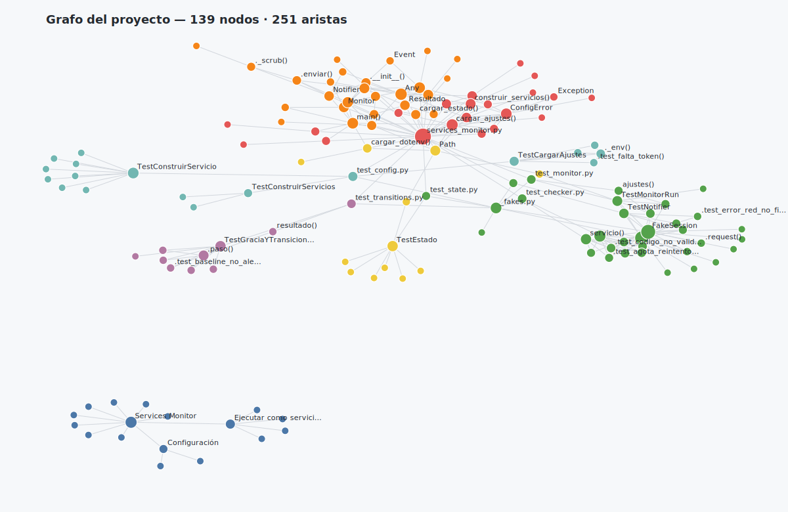

# Services Monitor



> Render del grafo de conocimiento del proyecto (generado con graphify). El HTML
> interactivo está en [`graphify-out/graph.html`](graphify-out/graph.html).

Monitor HTTP para Termux que revisa periódicamente la disponibilidad de uno o
más servicios web y envía alertas a Telegram cuando cambian de estado
(ACTIVO ↔ INACTIVO). Pensado para correr en segundo plano como servicio de
`termux-services`/runit.

## Qué hace `services_monitor.py`

- Cada `CHECK_INTERVAL` segundos (60 por defecto) comprueba cada servicio de
  `services.json` con el método HTTP configurado.
- Considera "activo" un servicio si el código HTTP está en `codigos_validos` y,
  opcionalmente, si el cuerpo contiene `contenido_esperado`.
- **Reintentos con backoff** ante errores de red (timeout, conexión) dentro de
  una misma comprobación.
- **Período de gracia**: un servicio solo pasa a INACTIVO tras `umbral_fallos`
  fallos consecutivos (y vuelve a ACTIVO tras `umbral_exitos` éxitos), evitando
  falsos positivos por fallos aislados.
- **Alertas sin ruido**: solo avisa cuando el estado *confirmado* cambia; no
  repite alertas mientras un servicio sigue caído.
- Envía un **resumen al iniciar**, una **alerta por cada cambio** y un **aviso
  al detenerse** (incluido `sv down`/SIGTERM).
- Guarda el último estado en `services_status.json` de forma **atómica** y
  tolera que ese archivo esté corrupto (lo respalda y sigue).
- **Logging** estructurado a stdout (INFO/WARNING/ERROR), que captura `svlogger`.
- **Nunca imprime** el token ni el chat_id en los logs.

## Requisitos

- Termux (Android) con acceso a `pkg`.
- Python 3.9 o superior.
- `python-requests` (o `pip install -r requirements.txt`).
- `termux-services` para gestionarlo con `runit`.
- Un bot de Telegram (`@BotFather`) y el `chat_id` destino de las alertas.
- Opcional: `termux-wake-lock` (evita que Android suspenda el proceso) y la app
  **Termux:Boot** (para arrancar el servicio al reiniciar el teléfono).

## Instalación

```sh
pkg update && pkg upgrade
pkg install python termux-services
pip install -r requirements.txt

# Credenciales (no se versionan):
cp .env.example .env
# editar .env y poner TELEGRAM_BOT_TOKEN y TELEGRAM_CHAT_ID

# Servicios a monitorear: ya viene un services.json de ejemplo.
# Para más opciones, mirá services.example.json.
```

Reiniciá la sesión de Termux tras instalar `termux-services` (cerrar y reabrir la
app, o `exit` y volver) para que arranque `runsvdir`, el supervisor de runit.

## Configuración

### Credenciales y ajustes globales (`.env` o variables de entorno)

Las credenciales se leen **solo** del entorno; si faltan, el monitor aborta con
un error claro. Se cargan desde un archivo `.env` (junto al script) o del entorno
real (que tiene prioridad). Ver [`.env.example`](.env.example).

| Variable | Descripción | Def. |
|----------|-------------|------|
| `TELEGRAM_BOT_TOKEN` | Token del bot de `@BotFather`. **Obligatoria.** | — |
| `TELEGRAM_CHAT_ID` | Chat/usuario/canal que recibe alertas. **Obligatoria.** | — |
| `LOG_LEVEL` | `DEBUG`/`INFO`/`WARNING`/`ERROR`. | `INFO` |
| `CHECK_INTERVAL` | Segundos entre rondas. | `60` |
| `HTTP_TIMEOUT` | Timeout HTTP por defecto (s). | `10` |
| `HTTP_REINTENTOS` | Reintentos ante error de red. | `2` |
| `HTTP_BACKOFF` | Backoff base (s), exponencial. | `1.0` |
| `UMBRAL_FALLOS` | Fallos seguidos para marcar INACTIVO. | `2` |
| `UMBRAL_EXITOS` | Éxitos seguidos para marcar ACTIVO. | `1` |
| `SERVICES_MONITOR_CONFIG` | Ruta al JSON de servicios. | `services.json` |
| `SERVICES_JSON` | Servicios en línea (JSON), alternativa al archivo. | — |

### Lista de servicios (`services.json`)

```json
[
    {
        "nombre": "LocalConfigs",
        "url": "http://127.0.0.1:8000",
        "metodo": "GET",
        "timeout": 10,
        "codigos_validos": [200, 301, 302],
        "headers": { "User-Agent": "services-monitor" },
        "contenido_esperado": "\"status\":\"ok\"",
        "umbral_fallos": 3,
        "umbral_exitos": 1,
        "reintentos": 2,
        "backoff_base": 1.0
    }
]
```

| Campo | Obligatorio | Descripción |
|-------|:-----------:|-------------|
| `nombre` | sí | Identificador único en logs y alertas. |
| `url` | sí | URL a chequear (`http://` o `https://`). |
| `metodo` | no (`GET`) | `GET`/`HEAD`/`POST`/`PUT`/`PATCH`/`DELETE`/`OPTIONS`. |
| `timeout` | no (`10`) | Segundos antes de timeout. |
| `codigos_validos` | no (`[200]`) | Códigos HTTP que cuentan como "activo". |
| `headers` | no | Headers personalizados (texto→texto). |
| `contenido_esperado` | no | Substring que debe aparecer en el cuerpo. |
| `umbral_fallos` / `umbral_exitos` | no | Gracia por servicio (sobrescriben el global). |
| `reintentos` / `backoff_base` | no | Reintentos de red por servicio. |

## Prueba manual

```sh
# Validar la configuración sin hacer red (no expone secretos):
python services_monitor.py --check-config

# Una sola ronda de comprobaciones y salir:
python services_monitor.py --once

# Ejecutar en primer plano (Ctrl+C para detener; envía aviso de apagado):
python services_monitor.py
```

## Ejecutar como servicio de `termux-services`

El servicio activo vive en `$PREFIX/var/service/services-monitor`. Cada servicio
runit es una carpeta con un script ejecutable `run` que hace `exec` del proceso.

### 1. Crear el servicio a partir del ejemplo

```sh
mkdir -p $PREFIX/var/service/services-monitor/log
cp run.example $PREFIX/var/service/services-monitor/run
# editar la ruta PROYECTO dentro de run si tu proyecto está en otro lugar
chmod +x $PREFIX/var/service/services-monitor/run
```

`run.example` hace `cd` al proyecto y `exec python3 services_monitor.py`, de modo
que el `.env` y `services.json` del proyecto se usan automáticamente. **No pongas
credenciales en `run`**: van en el `.env`.

### 2. (Opcional) Logging con `svlogger`

```sh
printf '#!/data/data/com.termux/files/usr/bin/sh\nexec svlogger $HOME/.termux/var/log/services-monitor\n' \
  > $PREFIX/var/service/services-monitor/log/run
chmod +x $PREFIX/var/service/services-monitor/log/run
```

### 3. Comandos de control

```sh
sv-enable services-monitor     # habilita y arranca
sv up services-monitor         # iniciar
sv down services-monitor       # detener (envía SIGTERM: apagado limpio + aviso)
sv restart services-monitor    # reiniciar (p. ej. tras editar services.json)
sv status services-monitor     # estado (up/down, PID, uptime)
sv-disable services-monitor    # deshabilitar

tail -f $HOME/.termux/var/log/services-monitor/current   # ver logs (si usás svlogger)
```

### 4. Mantenerlo vivo y arranque automático

```sh
termux-wake-lock      # evita que Android suspenda Termux (agregalo a tu .bashrc)
```

Para arrancar al reiniciar el teléfono, instalá **Termux:Boot** y creá
`~/.termux/boot/start-services.sh`:

```sh
#!/data/data/com.termux/files/usr/bin/sh
termux-wake-lock
sv-enable services-monitor
```
`chmod +x ~/.termux/boot/start-services.sh`.

## Tests

```sh
python -m unittest discover -s tests
```
Cubren: validación de configuración, cambios de estado y período de gracia,
errores de red con reintentos, y el notificador de Telegram (incluyendo que
**nunca** filtra el token ni el chat_id en los logs). No hacen red real.

## Archivos que genera el script

- `services_status.json`: último estado de cada servicio (atómico). Se puede
  borrar sin riesgo; se pierde solo la comparación de "cambio" hasta la próxima
  ronda. Está en `.gitignore`.

## Seguridad

Las credenciales van en `.env` (ignorado por git), nunca en el código ni en
`run`. El monitor jamás escribe el token ni el `chat_id` en los logs (las
excepciones de red se depuran antes de logearse).
